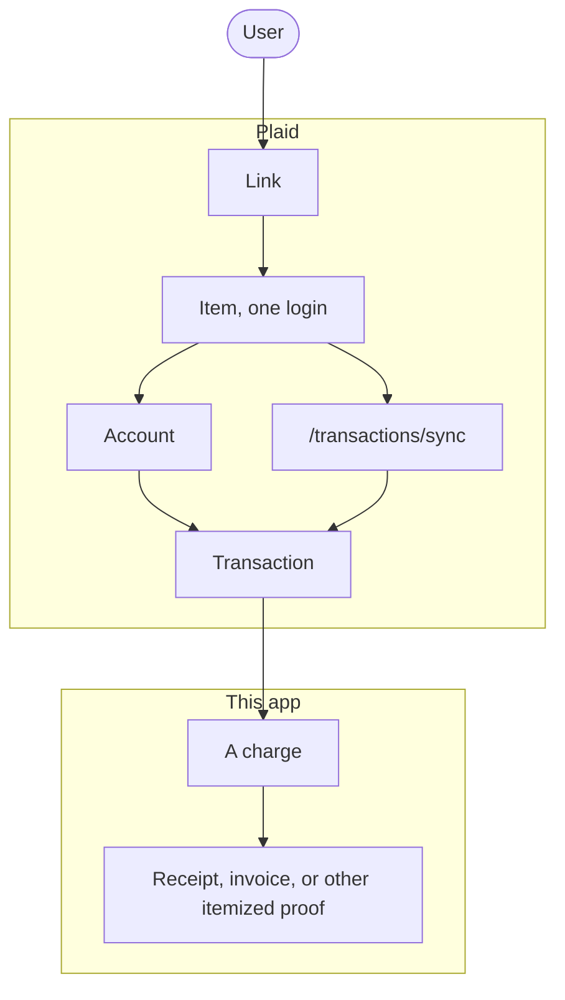

GenieFinanz syncs transactions from more than one account, then shows where the money went. Personal accounts and business ones, same engine.

You do that by attaching proof: receipts, invoices, anything else that breaks a charge into what you actually bought.

A checking account will show one payment to a credit card. That number does not tell you what you bought. The card has the store names. The receipt has the line items. This app keeps those next to each other.

I do not want another budget app. I want to open a charge and see the coffee, the milk, the tax. A business wants the same thing: open a charge and see the client lunch, the VAT, the project it sits in.

It pulls transactions from the accounts you connect and keeps pulling as new ones land. You attach a photo or a file to a charge. The app shows the charge and the itemized list together.

That is the whole product.

Bank accounts and cards first. Investments and loans can wait.

North America and Europe. I dropped India. That was extra.

Plaid is the first way I would pull US and Canada data. In Europe I would use someone like Tink so I am not talking to each bank myself. I have not signed anyone.

This hackathon build is Next.js, front and back in one repo.

Plaid is a contract and a pipe. It is not the product.

You send a person through Link. That creates one Item, which is one login at one bank. The Item has accounts. You call /transactions/sync and get added, changed, and removed transactions. Each transaction belongs to one account.

A positive amount means money left that account. A debit purchase is positive. A refund or a payment hitting the card is negative.

Plaid will not attach your receipt. Plaid will not match the checking payment to the card payment. That matching is ours, so we do not treat the card payment as spend.

The OpenAPI file is the contract. A copy lives at schemas/plaid-openapi.yml. You still need a Plaid app, Link, and an access token before anything comes back.

Six people are building it: Ahmed on product, Usama on backend, Salman on frontend, Wentan on compliance, Jason on data and setup, Nikhil on vision.

Hackathon. First note on 17 Aug 2026. This write-up on 28 Aug 2026. Repo exists. App is not built yet.
